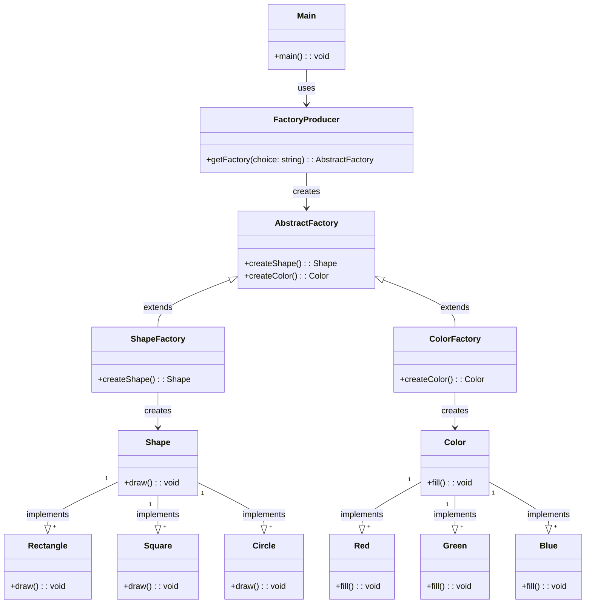

# 工厂模式
意图：提供一个创建一系列相关或相互依赖对象的接口，而无需指定它们具体的类。

主要解决：主要解决接口选择的问题。

何时使用：系统的产品有多于一个的产品族，而系统只消费其中某一族的产品。

如何解决：在一个产品族里面，定义多个产品。

## 菜鸟示例代码
我不会Java。可以帮我用C++重写一下吗？不要使用using namespace std;
```java
public interface Shape {
   void draw();
}

public class Rectangle implements Shape {
 
   @Override
   public void draw() {
      System.out.println("Inside Rectangle::draw() method.");
   }
}

public class Square implements Shape {
 
   @Override
   public void draw() {
      System.out.println("Inside Square::draw() method.");
   }
}

public class Circle implements Shape {
 
   @Override
   public void draw() {
      System.out.println("Inside Circle::draw() method.");
   }
}

public interface Color {
   void fill();
}

public class Red implements Color {
 
   @Override
   public void fill() {
      System.out.println("Inside Red::fill() method.");
   }
}

public class Green implements Color {
 
   @Override
   public void fill() {
      System.out.println("Inside Green::fill() method.");
   }
}

public class Blue implements Color {
 
   @Override
   public void fill() {
      System.out.println("Inside Blue::fill() method.");
   }
}

public abstract class AbstractFactory {
   public abstract Color getColor(String color);
   public abstract Shape getShape(String shape);
}

public class ShapeFactory implements AbstractFactory {
    
   @Override
   public Shape getShape(String shapeType){
      if(shapeType == null){
         return null;
      }        
      if(shapeType.equalsIgnoreCase("CIRCLE")){
         return new Circle();
      } else if(shapeType.equalsIgnoreCase("RECTANGLE")){
         return new Rectangle();
      } else if(shapeType.equalsIgnoreCase("SQUARE")){
         return new Square();
      }
      return null;
   }
   
   @Override
   public Color getColor(String color) {
      return null;
   }
}

public class ColorFactory implements AbstractFactory {
    
   @Override
   public Shape getShape(String shapeType){
      return null;
   }
   
   @Override
   public Color getColor(String color) {
      if(color == null){
         return null;
      }        
      if(color.equalsIgnoreCase("RED")){
         return new Red();
      } else if(color.equalsIgnoreCase("GREEN")){
         return new Green();
      } else if(color.equalsIgnoreCase("BLUE")){
         return new Blue();
      }
      return null;
   }
}

public class FactoryProducer {
   public static AbstractFactory getFactory(String choice){
      if(choice.equalsIgnoreCase("SHAPE")){
         return new ShapeFactory();
      } else if(choice.equalsIgnoreCase("COLOR")){
         return new ColorFactory();
      }
      return null;
   }
}

public class AbstractFactoryPatternDemo {
   public static void main(String[] args) {
 
      //获取形状工厂
      AbstractFactory shapeFactory = FactoryProducer.getFactory("SHAPE");
 
      //获取形状为 Circle 的对象
      Shape shape1 = shapeFactory.getShape("CIRCLE");
 
      //调用 Circle 的 draw 方法
      shape1.draw();
 
      //获取形状为 Rectangle 的对象
      Shape shape2 = shapeFactory.getShape("RECTANGLE");
 
      //调用 Rectangle 的 draw 方法
      shape2.draw();
      
      //获取形状为 Square 的对象
      Shape shape3 = shapeFactory.getShape("SQUARE");
 
      //调用 Square 的 draw 方法
      shape3.draw();
 
      //获取颜色工厂
      AbstractFactory colorFactory = FactoryProducer.getFactory("COLOR");
 
      //获取颜色为 Red 的对象
      Color color1 = colorFactory.getColor("RED");
 
      //调用 Red 的 fill 方法
      color1.fill();
 
      //获取颜色为 Green 的对象
      Color color2 = colorFactory.getColor("GREEN");
 
      //调用 Green 的 fill 方法
      color2.fill();
 
      //获取颜色为 Blue 的对象
      Color color3 = colorFactory.getColor("BLUE");
 
      //调用 Blue 的 fill 方法
      color3.fill();
   }
}
```


你可以用 Mermaid 画出你给的代码的框图吗？
## Mermaid diagram
implements的箭头指向反了。well，让chatgpt重画框图就到此为止吧。只是学一下怎么使用mermaid。
