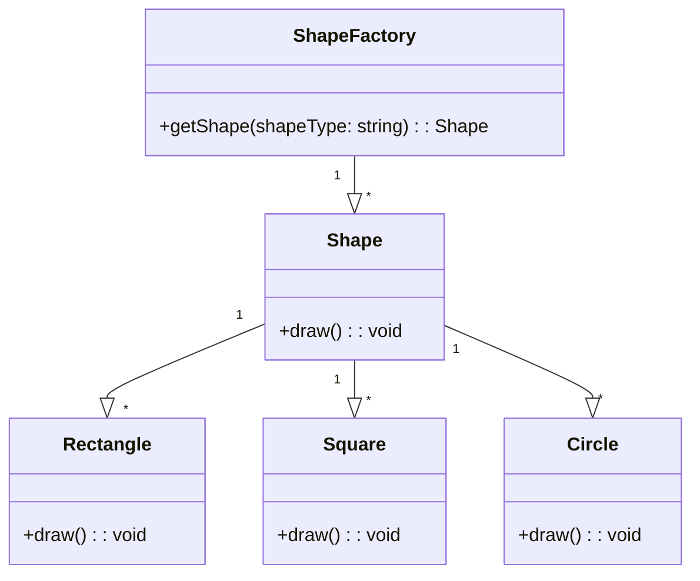

# 工厂模式
## 菜鸟示例代码
```java
public interface Shape {
   void draw();
}

public class Rectangle implements Shape {
 
   @Override
   public void draw() {
      System.out.println("Inside Rectangle::draw() method.");
   }
}

public class Square implements Shape {
 
   @Override
   public void draw() {
      System.out.println("Inside Square::draw() method.");
   }
}

public class Circle implements Shape {
 
   @Override
   public void draw() {
      System.out.println("Inside Circle::draw() method.");
   }
}

public class ShapeFactory {
    
   //使用 getShape 方法获取形状类型的对象
   public Shape getShape(String shapeType){
      if(shapeType == null){
         return null;
      }        
      if(shapeType.equalsIgnoreCase("CIRCLE")){
         return new Circle();
      } else if(shapeType.equalsIgnoreCase("RECTANGLE")){
         return new Rectangle();
      } else if(shapeType.equalsIgnoreCase("SQUARE")){
         return new Square();
      }
      return null;
   }
}

public class FactoryPatternDemo {
 
   public static void main(String[] args) {
      ShapeFactory shapeFactory = new ShapeFactory();
 
      //获取 Circle 的对象，并调用它的 draw 方法
      Shape shape1 = shapeFactory.getShape("CIRCLE");
 
      //调用 Circle 的 draw 方法
      shape1.draw();
 
      //获取 Rectangle 的对象，并调用它的 draw 方法
      Shape shape2 = shapeFactory.getShape("RECTANGLE");
 
      //调用 Rectangle 的 draw 方法
      shape2.draw();
 
      //获取 Square 的对象，并调用它的 draw 方法
      Shape shape3 = shapeFactory.getShape("SQUARE");
 
      //调用 Square 的 draw 方法
      shape3.draw();
   }
}
```
我不会Java。可以帮我用C++重写一下吗？不要使用using namespace std;
## Mermaid diagram
当然！以下是使用 Mermaid 画出的工厂模式（Factory Pattern）的框图：



这个框图清晰地展示了工厂模式的结构。Shape 是抽象类，定义了 draw() 方法；Rectangle、Square 和 Circle 是具体类，它们分别实现了 Shape 接口的 draw() 方法；ShapeFactory 是工厂类，通过 getShape(shapeType) 方法返回具体的形状对象。在框图中，箭头表示一个类与另一个类之间的关联关系，以及继承关系。ShapeFactory 关联着 Shape，表示 ShapeFactory 创建了具体的形状对象。同时，Rectangle、Square 和 Circle 继承自 Shape，表示它们都是 Shape 的子类。