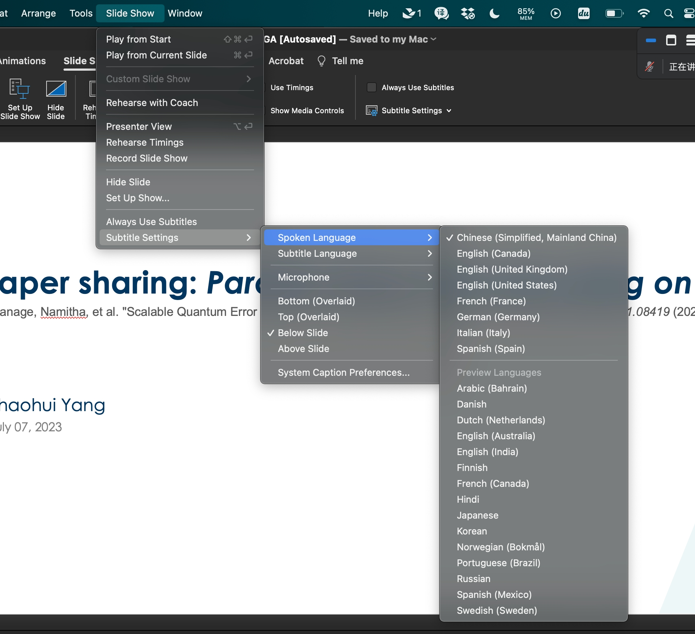
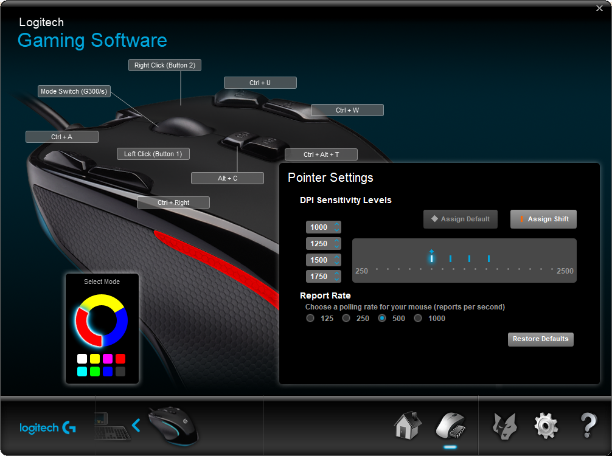
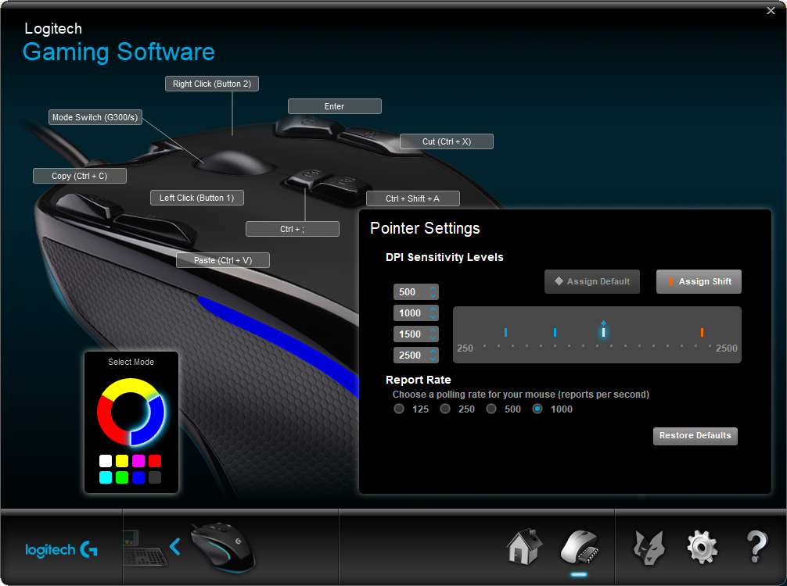
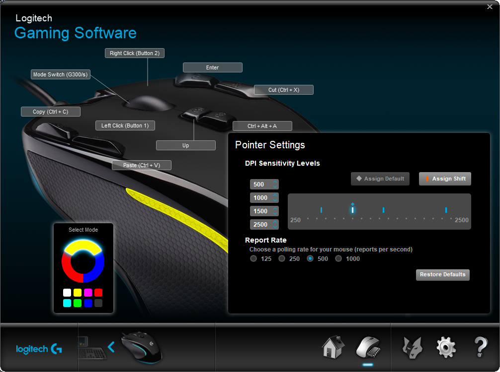
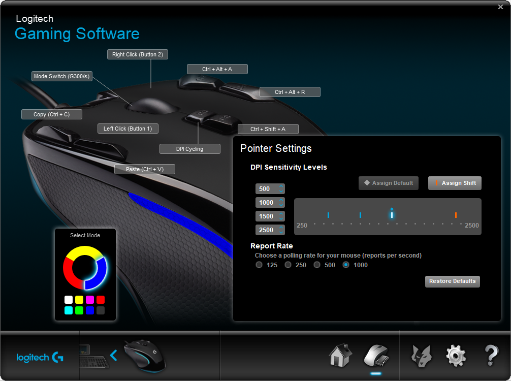

# some settings
## 移动热点自动启动
[Win11如何开机自启Wifi热点？Win11开机自动启动无线热点教程](https://www.xitongzhijia.net/xtjc/20230204/276010.html)

## PowerShell
[使用 PowerShell 将输出导出到文件](https://www.delftstack.com/zh/howto/powershell/powershell-out-file-append/#google_vignette)
## run
win+R

60秒后自动关机: shutdown -s -t 60

定时关机: at 18:00 shutdown -s

## shortcut
1. win + shift + s 是截图.
2. win + v 是剪切板.
3. win + Ctrl + O 是屏幕键盘.
4. Alt + Ctrl + Delete，立即终结电脑的异常状态
# some softwares
## Essential software
- [Clash for Windows](https://glados.rocks/console)
- [Feishu](https://www.feishu.cn/download)
- [Baidu Netdisk](https://pan.baidu.com/download/)
- [Baidu Input Method Editors](https://shurufa.baidu.com/)
[关于在Win11任务栏隐藏输入法（中英文切换）图标的解决办法](https://blog.csdn.net/weixin_47907823/article/details/121954248)
- [Mouse without Borders](https://www.microsoft.com/en-us/download/details.aspx?id=35460)
- [Sunlogin](https://sunlogin.oray.com/)
[最新Win11系统怎么删除开机密码 Win11取消登录密码图文教程](https://zhuanlan.zhihu.com/p/470573521)
为了提高安全性，这个选项怎么在联想小新air 14上消失了。或许是Windows更新了，堵上了这个漏洞。
- [Bing Wallpaper](https://www.microsoft.com/en-us/bing/bing-wallpaper)
- [StartAllBack](https://www.startallback.com/)
- [Listary](https://www.listary.com/download)
- [Open Broadcaster Software](https://obsproject.com/)
- [VLC](https://www.videolan.org/vlc/)
- [7-Zip](https://www.7-zip.org/)
- [Microsoft PowerToys](https://learn.microsoft.com/en-us/windows/powertoys/)
- [Coremail](https://www.lunkr.cn/download.html#email)
- [网易灵犀办公](https://office.163.com)
- [Outlook requires updates before it can start](https://learn.microsoft.com/en-us/answers/questions/830716/outlook-requires-updates-before-it-can-start)
- [Wemeet](https://meeting.tencent.com/)
- Wechat
- QQ
- Telegram(gpt bot)
- [Calibre](https://calibre-ebook.com/download)
[最强大的本地电子书管理工具：Calibre 使用指南](https://zhuanlan.zhihu.com/p/34996144)
- 网易有道翻译
- 网易云音乐
- PowerPoint 已经实现演讲者实时翻译了！

## [logitech mouse G300s](https://support.logi.com/hc/zh-cn/articles/360025298053)
### linux 下设置



### win 下设置
现在yellow是日常。blue以后再说，有需求才会更新设置。



## edge
- [CSDN 代码复制限制](https://greasyfork.org/zh-CN/scripts/454012-csdn-%E4%BB%A3%E7%A0%81%E5%A4%8D%E5%88%B6%E9%99%90%E5%88%B6)
- 强制黑色背景
edge://flags/#enable-force-dark
- [关闭edge选中/复制文本时显示小菜单/方框](https://blog.csdn.net/qq_45611850/article/details/121380355)
- 视频倍速
```html
右键 inspect，console。
document.querySelector('video').playbackRate = 0.9
```
- 同步问题
据我观察，如果一直setting up sync，那就关闭外网、重新登录都试一试。
## [Visual Studio Code](https://code.visualstudio.com/shortcuts/keyboard-shortcuts-windows.pdf)
Windows 下 vscode ssh 连接服务器的设置。
### oh my zsh
- autosuggestion 
- syntax-highlighting
- autojump
- Powerlevel10k
1. 集群上设置zsh为默认
然而，在其他终端或软件中，可能会以非登录 Shell 的方式启动，从而只加载 ~/.bashrc 文件，而不加载 ~/.bash_profile 文件。这就解释了为什么你的 bashrc 在其他软件中无法自动执行。
解决方案：在.bashrc、.bash_profile都启动zsh。
2. vscode怎么设置zsh为默认
要在最新的 VS Code 中设置默认的终端 shell，请按照以下步骤进行操作：
打开 VS Code 并进入菜单栏的 “File”（文件）选项。
选择 “Preferences”（首选项）并点击 “Settings”（设置）。
在设置页面的搜索框中，输入 “terminal.integrated.defaultProfile.linux”。
在右侧的下拉菜单中，选择您想要的默认终端 shell。如果您已经安装了 Zsh，则可能会看到类似 “zsh” 或 “Zsh” 的选项。
保存设置并关闭页面。
现在，当您在 VS Code 中打开终端时，它应该默认使用您选择的终端 shell。
3. some alias
```shell
# clash
open () {
  ports=(7890 7891 9090)
  for port in "${ports[@]}"
  do
    pids=$(lsof -i TCP:$port -t)
    if [[ -n $pids ]]; then
      echo "Killing processes on port $port: $pids"
      pkill -TERM -P $pids
    fi
  done
  echo "GLaDOS proxy enabled"
  cd /public/home/zhangwch2022/software/clash
  # ./clash-linux-amd64-v1.10.0 -f wyc-glados.yaml -d .
  ./clash-linux-amd64-v1.10.0 -f zwc-glados.yaml -d .
}
close () {
  ports=(7890 7891 9090)  # 要关闭的端口数组
  for port in "${ports[@]}"
  do
    pids=$(lsof -i TCP:$port | awk 'NR!=1 {print $2}')
    for pid in $pids
    do
      echo "Killing process $pid"
      kill -9 $pid
    done
    echo "Port $port closed"
  done
}
up () {
  # export http_proxy="127.0.0.1:7890"
  # export https_proxy="127.0.0.1:7890"
  export http_proxy="http://127.0.0.1:7890"
  export https_proxy="http://127.0.0.1:7890"

  env | grep -i proxy
}
down () {
  unset http_proxy
  unset https_proxy
  env | grep -i proxy
}
# curl https://en.wikipedia.org/wiki/Beijing
# curl https://www.baidu.com/
# curl https://www.google.com/
```
## [Zotero](https://www.zotero.org/download/)
[Zotero更改储存路径&迁移文件](https://zhuanlan.zhihu.com/p/478035708)

[文献管理软件——Zotero以及实用插件介绍 第一期](https://www.bilibili.com/video/BV1L24y117Qr/?share_source=copy_web)

[zotero+坚果云](https://blog.csdn.net/weixin_37707670/article/details/110307759)
## [iVCam](https://www.e2esoft.com/ivcam/)
试用期后，不能使用大于640*480的视频尺寸

## [MobaXterm](https://mobaxterm.mobatek.net/download.html)
自带x11转发
休息时候有4只企鹅蹦，很可爱
## MySQL
https://www.runoob.com/mysql/mysql-install.html

```powershell
net start mysql
mysql -u root -p
ALTER USER 'root'@'localhost' IDENTIFIED BY '234321';
```

## WSL 2
如果单位没有服务器，可以考虑用WSL 2。（不过听说Windows又出了新的虚拟机技术？）
[如何在 Windows 10 上安装 WSL 2](https://docs.microsoft.com/zh-cn/windows/wsl/install-win10)
# Removable storage device
[U盘写保护无法格式化怎么办？](https://www.reneelab.com.cn/m/how-to-format-write-protected-usb.html)

[Windows下使用Diskpart格式化U盘](https://www.cnblogs.com/zhuxiaoxi/p/9292863.html)
# Download YouTube videos
https://www.youtube.com/watch?v=K1lQa5QsyDU

加上ss，非美国节点，即可下载。
https://www.ssyoutube.com/watch?v=K1lQa5QsyDU