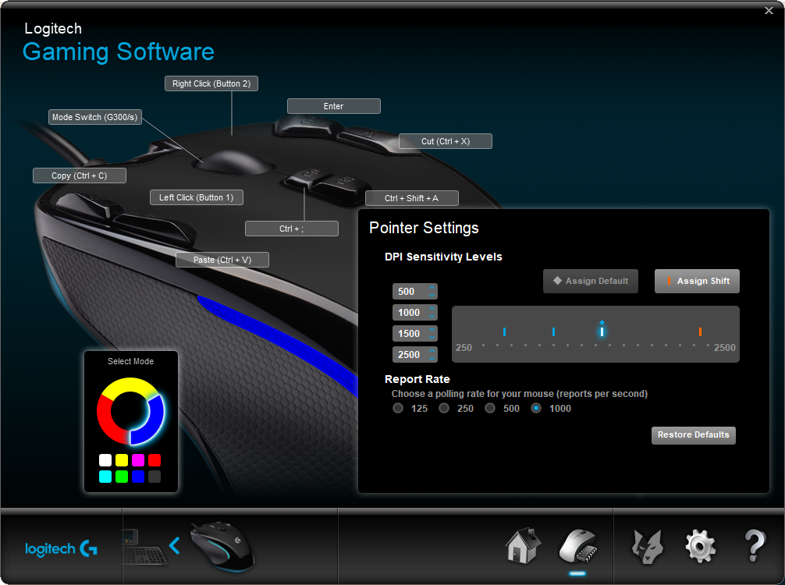

# Debian基本的装机问题
微信、罗技鼠标的设置软件lgs，必须是Windows or macOS。

[如何轻松安装 Debian Linux 系统](https://zhuanlan.zhihu.com/p/410974122)

ISO下载
https://cdimage.debian.org/cdimage/unofficial/non-free/cd-including-firmware/11.6.0-live+nonfree/amd64/iso-hybrid/

balena下载
https://www.balena.io/etcher#download-etcher

[原创-解决Parrot安装卡在91%](https://blog.csdn.net/xyq165980/article/details/128259388)

[How To Fix Busybox Initramfs Error On Ubuntu](https://ostechnix.com/how-to-fix-busybox-initramfs-error-on-ubuntu/)

开机总是出现default keyring输入密码: 终端输入seahorse，把default keyring的密码设为空。

[ubuntu20.04 黑屏/紫屏后的处理办法](https://codeantenna.com/a/GWbmAVSb7g)
ctrl + alt + F3

[mount 挂载磁盘报错 mount: wrong fs type, bad option, bad superblock on](https://blog.csdn.net/wohu1104/article/details/121021207)

[You are in emergency mode ... Cannot open access to console, the root account is locked. 的一种解决方法](https://ld246.com/article/1629522554915)
# 必备软件
- clash、飞书、百度网盘、向日葵、zoom、discord、telegram、cursor、Typora beta、OBS Studio
## Fcixt 5
候选翻页：逗号句号。
Ctrl+; 进入剪贴板输入模式.
ctrl+alt+H：激活 spell hint状态，把 "choose key modifier"由 alt 改成 none ,作用是选词时免按alt.
### 微软拼音的使用
- People name input：
During pinyin input, use "semicolon + r" to enter into people nameinput mode. When in double pinyin mode, press "Shift + semicolon" keyand then "r" key to enter into people name input mode.
具体操作是先输入人名拼音，然后按下组合键shift+;再按 r 进入人名模式，这样出来的候选词都是姓氏+名字，很符合中文取名规律。
- U-mode input：
Use U-mode to input Chinese character based on its stroke orcomponent,or to input symbol. When in Double Pinyin mode, U-modecan be triggered by "Shift + u"
- V-mode input：
Use V-mode to input Chinese format number, date and time etc. Whenin Double Pinyin mode, V-mode can be triggered by "Shift + v"
## 向日葵
最新Win11系统怎么删除开机密码 Win11取消登录密码图文教程 - B站今雨雪的文章 - 知乎
https://zhuanlan.zhihu.com/p/470573521
## Wemeet
```
腾讯会议不兼容wayland协议怎么解决？
Debian 
sudo vim /etc/gdm3/daemon.conf
把 #WaylandEnable=false 的注释井号去掉
sudo service gdm3 restart
```
## libreoffice
```
libreoffice --impress --norestore 2.4git课程材料.pptx &
sudo apt-get update
sudo apt-get install libreoffice-java-common
```
## Zotero
[ubuntu安装Zotero,任何版本ubuntu适用](https://blog.csdn.net/xinjieyuan/article/details/105407564)

[文献管理软件——Zotero以及实用插件介绍 第一期](https://www.bilibili.com/video/BV1L24y117Qr/?share_source=copy_web)

[zotero+坚果云](https://blog.csdn.net/weixin_37707670/article/details/110307759)
## vscode
### .bashrc and .zshrc
- oh my zsh
- autosuggestion 
- autojump
### Extensions
- Remote - SSH
- vscode-pdf
- GitHub Copilot
### Git
https://learngitbranching.js.org/?locale=zh_CN
```
git clone https://xxxxx
新手用的最多的三条命令
git add .
git commit -m 'update'
git push
然后你发现不够用, 你会学到
git commit --amend
git push -f
git reset
git reset --hard
git revert
git config --global user.name "zvvc"
git config --global user.email "zwc@outlook.lv"
git push origin zvvc
```
#### stargazers
https://github.com/Zhang-Wen-chao/CS240/stargazers
#### 解决github文件夹有向右的白色箭头并且不能打开的解决办法
https://www.jianshu.com/p/7cc6ea70e48e
### Settings
- autosave
### 环境管理
- miniconda3
```
wget https://repo.anaconda.com/miniconda/Miniconda3-latest-Linux-x86_64.sh
bash Miniconda3-latest-Linux-x86_64.sh
```
- Debian 11 / Ubuntu 22.04 安装 Docker 以及 Docker Compose 教程
```
https://u.sb/debian-install-docker/

sudo docker run --name mysql -e MYSQL_ROOT_PASSWORD=yourpassword -d mysql:latest
sudo docker run -it --rm --link mysql:mysql mysql mysql -hmysql -uroot -p

CREATE DATABASE testdb;
USE testdb;
CREATE TABLE users (id INT PRIMARY KEY, name VARCHAR(50));
INSERT INTO users (id, name) VALUES (1, 'John'), (2, 'Jane'), (3, 'Bob');
SELECT * FROM users;
```
## edge
### CSDN 代码复制限制
https://greasyfork.org/zh-CN/scripts/454012-csdn-%E4%BB%A3%E7%A0%81%E5%A4%8D%E5%88%B6%E9%99%90%E5%88%B6
### 强制黑色背景
edge://flags/#enable-force-dark
### 关闭edge选中/复制文本时显示小菜单/方框
https://blog.csdn.net/qq_45611850/article/details/121380355
### 视频倍速
右键 inspect，console。

document.querySelector('video').playbackRate = 0.9
### 同步问题
据我观察，如果一直setting up sync，那就关闭外网、重新登录都试一试。
# linux常见的命令行和快捷键（带英文全称，便于记忆）
用vim不是为了炫技。vim也只是一个古老的文本编辑器。

移动模式: h(左)j(下)k(上)l(右) 一定要最先的记死用熟
插入模式: 你可以输入想要输入的东西,没什么可以说的
保存文件: :w然后回车
复制内容: v 进入虚拟模式, hjkl 移动复制, 然后按下 y
粘贴内容: p
为什么要学 vim
方向键联系 hjkl
h左，j下，k上，l右

- w 光标向前移动到下个单词首字母，，3w
- W 跳转到下一个字符串的首字母 （对应英文单词Word）
- e 光标向前移动到单词尾字母，，2e
- E 跳转到下一个字符串的尾字母 （对应英文单词End）
- b 光标向后移动到单词首字母
- B 光标向后移动到字符串首
- x 删除字符串
- r 更改一个字符 （对应英文单词Replace）
- d 可与w、e、b、W、E、B、h、j、k、l、d等字符组合，用来删除字符串或者句子。 （对应英文单词Delete）
- dl 与x功能一样，删除光标下一个字符，相当于键盘上的Del； dh 与之相反，功能相当于键盘上的backspace
- dw、de、dW、dE 均为向后删除一个单词或字符串，区别在于de/dE是从当前位置到单词或字符串末尾，而dw/dW是删除当前位置到下一个单词或字符串之前
- db、dB 向前删除一个单词或字符串。需要注意的是光标下的字符不删除
- dk、dj 分别是向上和向下删除两行
- dd 删除本行
dd         删除
3dd        删除三行
复制 & 粘贴
CV 大法好，毕竟大家有时候自嘲都是 C V 工程师   所以 复制 粘贴 还是需要在第一时间学会，这样才能更好的 coding 
- yy 复制当前行
- p 粘贴
# 未来买什么
2023年4月29日更新：我现在什么都不想买。
反正研究生三年，感觉是真的什么电子设备都不用再买了。
想发文章，然后做工程，毕业去美国.
## 我现在有什么
魏傲给的机械键盘。我买的有线罗技鼠标（https://support.logi.com/hc/zh-cn/articles/360025298053   https://www.logitechg.com.cn/zh-cn/innovation/g-hub.html）。这两个要充分搞熟，打算用很多年。

这个鼠标就是为 linux 服务的，用 linux 系统的快捷键来设置它。

暂时就想到蓝色红色两个模式下，能做什么。日后随着使用，再想黄色的需求。


## 移动设备
小平板，还有一个罗技粉丝鼠标，是用接收器的，这个比较烦，必须有USB接口。再买笔记本就买有隐藏USB接口的。
## 想购买的产品
我现在甚至不想要普通的台式机了，我想自己组装nas，拥有自己的服务器。

台式机嘛：16G×2，512G固态硬盘，4K显示器，4060桌面端显卡（等等看，发布后什么评价）

笔记本电脑，哪怕是8500的暗影精灵9，也被喷使用起来很糟心。

也没那么想买：米家智能显示器挂灯 1S 相较于米家显示器挂灯显色指数提高至 R95 灯光下对色彩的还原更加真实。最大亮度由 270lm 提升到 300lm, 最大照度提升至 900lx（H=45cm）米家智能显示器挂灯 1S 连接米家 APP 绑定，设置智能场景，使用小爱同学语音控制。

如果后期不再使用所有Windows电脑，可以考虑：苹果触控板，搭配苹果电脑很舒服。

Galaxy Tab S8+，可以的，5g，能打电话，还能给其他设备放热点。直接取代手机，因为感觉手机对我用处也不大。用平板背上我的北师大帆布包，带个蓝牙耳机，挺合适的，也不会错过电话。8+是因为我去店里看了，能配上键盘，这就可以实现简单的文字处理了，甚至是用向日葵写代码。电脑模式真正做好的只有三星，适配所有软件，其他厂商完全相反，几乎所有软件都不适配

另一个可选项是华为matepad se的LTE版本，23年2月上市的。但不能用谷歌、没有5G，那就不买。

买特斯拉电车，带T的，排量大，加速度大，有给手机充电的口，能用苹果的 carplay。
## 历史产品
iPhone se 2，下单日期2021/06/16
2022/9/3，换一块飞毛腿电池。
2023/2/3，飞毛腿电池鼓包了，售后免费换新了一块。
2022/01/01购买的电器：长虹小太阳，美的微波炉，飞科电吹风。3年全保换新。
2022/09/11购买的，绿联网线转接器。3年全保换新。
2022/09/15购买的，九号c15电滑板。3年全保换新。
2022/11/22购买的，绿联type-c拓展坞，4年换新升级服务。